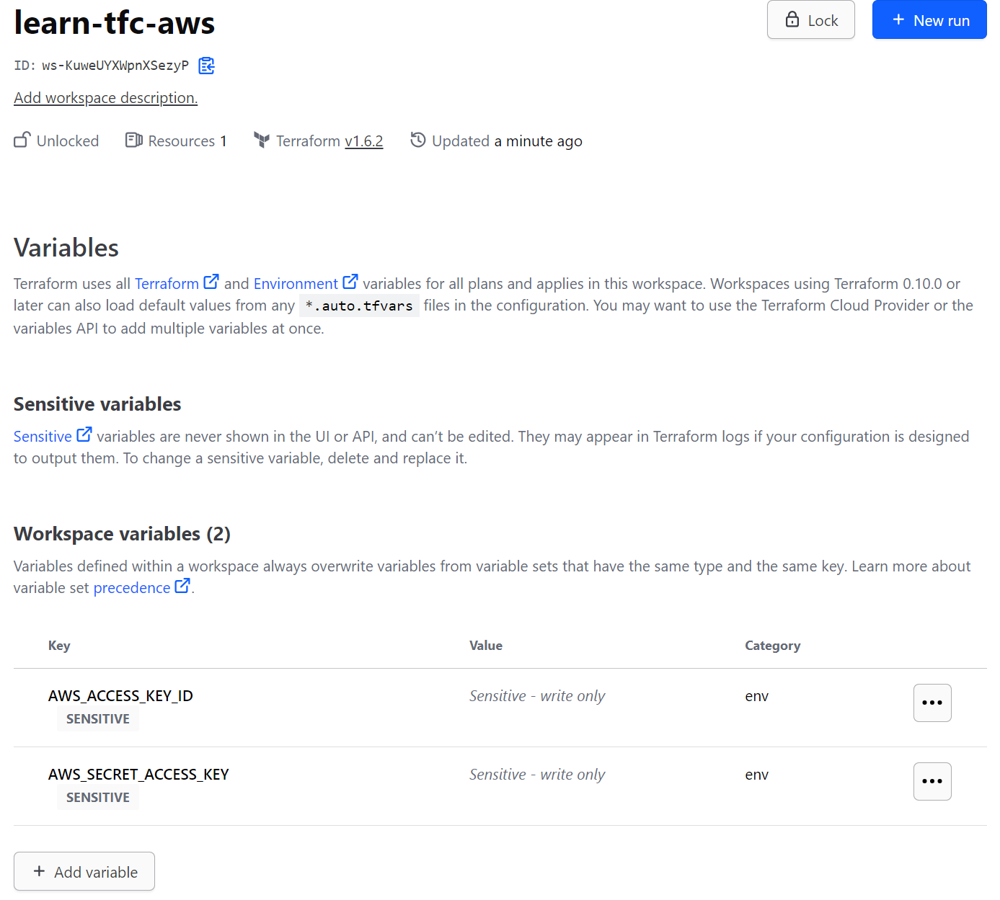

# Project-4

# What is Infrastructure as Code with Terraform?

Infrastructure as Code (IaC) tools allow you to manage infrastructure with configuration files rather than through a graphical user interface. IaC allows you to build, change, and manage your infrastructure in a safe, consistent, and repeatable way by defining resource configurations that you can version, reuse, and share.

Terraform is HashiCorp's infrastructure as code tool. It lets you define resources and infrastructure in human-readable, declarative configuration files, and manages your infrastructure's lifecycle.

### Define input variables
https://developer.hashicorp.com/terraform/tutorials/aws-get-started/aws-variables

Set the instance name with a variable
The current configuration includes a number of hard-coded values. Terraform variables allow you to write configuration that is flexible and easier to re-use.

Add a variable to define the instance name.

Create a new file called `variables.tf` with a block defining a new `instance_name` variable.

```sh
variable "instance_name" {
  description = "Value of the Name tag for the EC2 instance"
  type        = string
  default     = "ExampleAppServerInstance"
}
```

In `main.tf`, update the `aws_instance` resource block to use the new variable.
The `instance_name` variable block will default to its default value
("ExampleAppServerInstance") unless you declare a different value.

```sh
resource "aws_instance" "app_server" {
   ami           = "ami-08d70e59c07c61a3a"
   instance_type = "t2.micro"

   tags = {
-    Name = "ExampleAppServerInstance"
+    Name = var.instance_name
   }
 }
```

### Query data with outputs

Output EC2 instance configuration
Create a file called `outputs.tf` in your `Project-4` directory.

Add the configuration below to `outputs.tf` to define outputs for your EC2 instance's ID and IP address.

```sh
output "instance_id" {
  description = "ID of the EC2 instance"
  value       = aws_instance.app_server.id
}

output "instance_public_ip" {
  description = "Public IP address of the EC2 instance"
  value       = aws_instance.app_server.public_ip
}
```

### Inspect output values
You must apply this configuration before you can use these output values.
Apply your configuration now. Respond to the confirmation prompt with `yes`.

Terraform prints output values to the screen when you apply your configuration.
Query the outputs with the `terraform output` command.

```sh
terraform output
 
instance_id = "i-0bf954919ed765de1"
instance_public_ip = "54.186.202.254"

```

You can use Terraform outputs to connect your Terraform projects with
other parts of your infrastructure, or with other Terraform projects. 


### Store remote state
Now you have built, changed, and destroyed infrastructure from your local machine. This is great for testing and development, but in production environments you should keep your state secure and encrypted, where your teammates can access it to collaborate on infrastructure. The best way to do this is by running Terraform in a remote environment with shared access to state.

***`Terraform Cloud`*** allows teams to easily version, audit, and collaborate on infrastructure changes. It also securely stores variables, including API tokens and access keys, and provides a safe, stable environment for long-running Terraform processes.

In this tutorial, you will migrate your state to Terraform Cloud.

### Set up Terraform Cloud

```
main.tf
terraform {
  cloud {
    organization = "organization-name"
    workspaces {
      name = "learn-tfc-aws"
    }
  }

  required_providers {
    aws = {
      source  = "hashicorp/aws"
      version = "~> 4.16"
    }
  }
}
```

### Login to Terraform Cloud
Next, log into your Terraform Cloud account with the Terraform CLI in your terminal.

```sh
terraform login
```

Confirm with a `yes` and follow the workflow in the browser window that will automatically open. You will need to paste the generated API key into your Terminal when prompted.

Initialize Terraform
Now that you have configured your Terraform Cloud integration, run terraform init to re-initialize your configuration and migrate your state file to Terraform Cloud. Enter "yes" when prompted to confirm the migration.

```sh
terraform init
```

Now that Terraform has migrated the state file to Terraform Cloud, delete the local state file.
```sh
rm terraform.tfstate
```

When using Terraform Cloud with the CLI-driven workflow, you can choose to have Terraform run remotely, or on your local machine. When using local execution, Terraform Cloud will execute Terraform on your local machine and remotely store your state file in Terraform Cloud. For this tutorial, you will use the remote execution mode.


### Set workspace variables

The `terraform init` step created the `learn-tfc-aws` workspace in your Terraform Cloud organization. You must configure your workspace with your AWS credentials to authenticate the AWS provider.

Navigate to your `learn-tfc-aws` workspace in Terraform Cloud and go to the workspace's Variables page. Under **Workspace Variables**, add your `AWS_ACCESS_KEY_ID` and `AWS_SECRET_ACCESS_KEY` as **Environment Variables**, making sure to mark them as "Sensitive".





### Apply the configuration

Now, run `terraform apply` to trigger a run in Terraform Cloud. Terraform will show that there are no changes to be made.

```sh
terraform apply
```


Terraform is now storing your state remotely in Terraform Cloud. Remote state storage makes collaboration easier and keeps state and secret information off your local disk. Remote state is loaded only in memory when it is used.


### Destroy your infrastructure
Make sure to run `terraform destroy` to clean up the resources you created in these tutorials.
Terraform will execute this run in Terraform Cloud and stream the output to your terminal window.
When prompted, remember to confirm with a `yes`. You can also confirm the operation by visiting your workspace in the Terraform Cloud web UI and confirming the run.

```sh
terraform destroy
```

---
REFERENCES:
https://developer.hashicorp.com/terraform/tutorials/aws-get-started
----